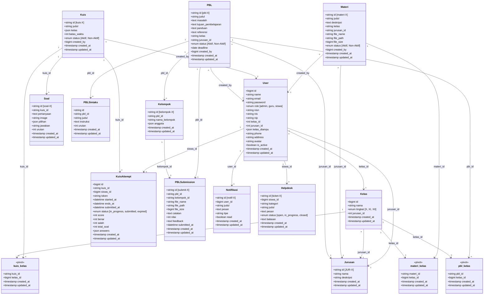

# Jagat Kawruh - Class Diagram

```mermaid
classDiagram
    direction TB
    
    %% ===== USER & AUTH =====
    class User {
        +bigint id
        +string name
        +string email
        +string password
        +enum role [admin, guru, siswa]
        +string nisn
        +string nis
        +string nip
        +int kelas_id
        +int jurusan_id
        +json kelas_diampu
        +string phone
        +string address
        +string avatar
        +boolean is_active
        +timestamp created_at
        +timestamp updated_at
    }

    %% ===== MASTER DATA =====
    class Jurusan {
        +string id [JUR-X]
        +string nama
        +string deskripsi
        +timestamp created_at
        +timestamp updated_at
    }

    class Kelas {
        +bigint id
        +string nama
        +enum tingkat [X, XI, XII]
        +int jurusan_id
        +timestamp created_at
        +timestamp updated_at
    }

    %% ===== MATERI =====
    class Materi {
        +string id [materi-X]
        +string judul
        +text deskripsi
        +string kelas
        +string jurusan_id
        +string file_name
        +string file_path
        +bigint file_size
        +enum status [Aktif, Non-Aktif]
        +bigint created_by
        +timestamp created_at
        +timestamp updated_at
    }

    class materi_kelas {
        <<pivot>>
        +string materi_id
        +bigint kelas_id
        +timestamp created_at
        +timestamp updated_at
    }

    %% ===== KUIS SYSTEM =====
    class Kuis {
        +string id [kuis-X]
        +string judul
        +json kelas
        +int batas_waktu
        +enum status [Aktif, Non-Aktif]
        +bigint created_by
        +timestamp created_at
        +timestamp updated_at
    }

    class kuis_kelas {
        <<pivot>>
        +string kuis_id
        +bigint kelas_id
        +timestamp created_at
        +timestamp updated_at
    }

    class Soal {
        +string id [soal-X]
        +string kuis_id
        +text pertanyaan
        +string image
        +json pilihan
        +string jawaban
        +int urutan
        +timestamp created_at
        +timestamp updated_at
    }

    class KuisAttempt {
        +bigint id
        +string kuis_id
        +bigint siswa_id
        +string token
        +datetime started_at
        +datetime ends_at
        +datetime submitted_at
        +enum status [in_progress, submitted, expired]
        +int score
        +int benar
        +int salah
        +int total_soal
        +json answers
        +timestamp created_at
        +timestamp updated_at
    }

    %% ===== PBL SYSTEM =====
    class PBL {
        +string id [pbl-X]
        +string judul
        +text masalah
        +text tujuan_pembelajaran
        +text panduan
        +text referensi
        +string kelas
        +string jurusan_id
        +enum status [Aktif, Non-Aktif]
        +date deadline
        +bigint created_by
        +timestamp created_at
        +timestamp updated_at
    }

    class pbl_kelas {
        <<pivot>>
        +string pbl_id
        +bigint kelas_id
        +timestamp created_at
        +timestamp updated_at
    }

    class PBLSintaks {
        +string id
        +string pbl_id
        +string judul
        +text instruksi
        +int urutan
        +timestamp created_at
        +timestamp updated_at
    }

    class Kelompok {
        +string id [kelompok-X]
        +string pbl_id
        +string nama_kelompok
        +json anggota
        +timestamp created_at
        +timestamp updated_at
    }

    class PBLSubmission {
        +string id [submit-X]
        +string pbl_id
        +string kelompok_id
        +string file_name
        +string file_path
        +bigint file_size
        +text catatan
        +int nilai
        +text feedback
        +datetime submitted_at
        +timestamp created_at
        +timestamp updated_at
    }

    %% ===== SUPPORT SYSTEM =====
    class Notifikasi {
        +string id [notif-X]
        +bigint user_id
        +string judul
        +text pesan
        +string tipe
        +boolean read
        +timestamp created_at
        +timestamp updated_at
    }

    class Helpdesk {
        +string id [ticket-X]
        +bigint siswa_id
        +string kategori
        +string judul
        +text pesan
        +enum status [open, in_progress, closed]
        +text balasan
        +timestamp created_at
        +timestamp updated_at
    }

    %% ===== RELATIONSHIPS =====
    
    %% User Relations
    User "n" --> "1" Kelas : kelas_id
    User "n" --> "1" Jurusan : jurusan_id
    User "1" --> "n" KuisAttempt : siswa_id
    User "1" --> "n" Notifikasi : user_id
    User "1" --> "n" Helpdesk : siswa_id

    %% Kelas & Jurusan
    Kelas "n" --> "1" Jurusan : jurusan_id

    %% Materi Relations
    Materi "n" --> "1" User : created_by
    Materi "n" --> "1" Jurusan : jurusan_id
    Materi "1" --> "n" materi_kelas : materi_id
    Kelas "1" --> "n" materi_kelas : kelas_id

    %% Kuis Relations
    Kuis "n" --> "1" User : created_by
    Kuis "1" --> "n" Soal : kuis_id
    Kuis "1" --> "n" KuisAttempt : kuis_id
    Kuis "1" --> "n" kuis_kelas : kuis_id
    Kelas "1" --> "n" kuis_kelas : kelas_id

    %% PBL Relations
    PBL "n" --> "1" User : created_by
    PBL "n" --> "1" Jurusan : jurusan_id
    PBL "1" --> "n" PBLSintaks : pbl_id
    PBL "1" --> "n" Kelompok : pbl_id
    PBL "1" --> "n" PBLSubmission : pbl_id
    PBL "1" --> "n" pbl_kelas : pbl_id
    Kelas "1" --> "n" pbl_kelas : kelas_id

    %% Kelompok & Submission
    Kelompok "1" --> "n" PBLSubmission : kelompok_id
```
